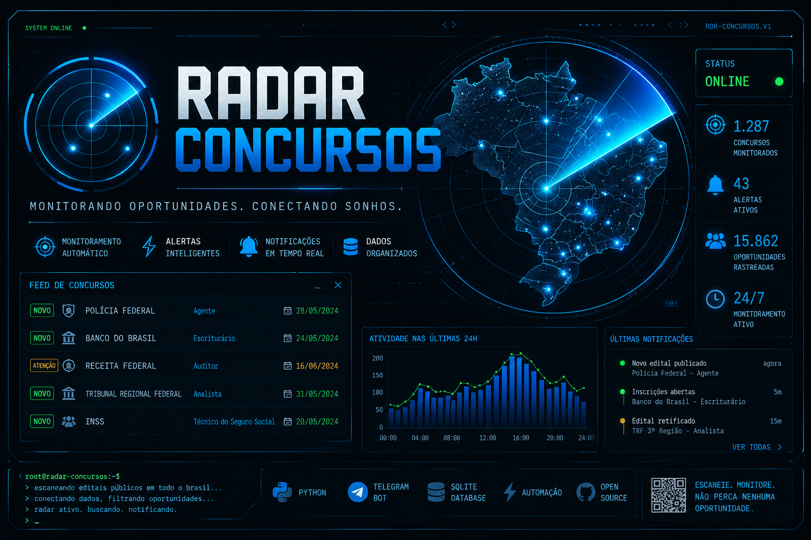

<div align="center">



# 🎯 Radar Concursos

### _Monitorando Oportunidades. Conectando Sonhos._

[](https://python.org)
[](https://core.telegram.org/bots)
[](https://sqlite.org)
[](LICENSE)
[]()

</div>

---

## 📡 Sobre o Projeto

O **Radar Concursos** é um sistema automatizado de monitoramento de concursos públicos no Brasil. Ele escaneia editais publicados em todo o país, organiza as oportunidades e envia notificações em tempo real via Telegram — para que você nunca perca um prazo ou uma vaga.

> 💡 **1.287** concursos monitorados · **43** alertas ativos · **15.862** oportunidades rastreadas · **24/7** operando

---

## ✨ Funcionalidades

| Recurso | Descrição |
|---|---|
| 🎯 **Monitoramento Automático** | Varredura contínua de fontes oficiais de editais em todo o Brasil |
| ⚡ **Alertas Inteligentes** | Notificações personalizadas com base no perfil e preferências do usuário |
| 🔔 **Notificações em Tempo Real** | Integração com Telegram Bot para alertas instantâneos |
| 🗄️ **Dados Organizados** | Banco SQLite estruturado com histórico e rastreamento de concursos |
| 📊 **Dashboard de Atividade** | Visualização das últimas 24h de monitoramento e eventos |
| 🗺️ **Cobertura Nacional** | Monitora concursos em todos os estados do Brasil |

---

## 🏛️ Concursos Monitorados (Exemplos)

- 🚔 **Polícia Federal** — Agente Federal
- 🏦 **Banco do Brasil** — Escriturário
- 💰 **Receita Federal** — Auditor Fiscal
- ⚖️ **Tribunal Regional Federal** — Analista Judiciário
- 🏛️ **INSS** — Técnico do Seguro Social

> E muito mais — o radar monitora automaticamente centenas de órgãos públicos federais, estaduais e municipais.

---

## 🛠️ Stack Tecnológica

```
🐍 Python        →  Core do sistema e automações
✈️ Telegram Bot  →  Interface de notificações e alertas
🗄️ SQLite        →  Armazenamento e histórico de concursos
⚡ Automação     →  Agendamento e execução periódica
🌐 Open Source   →  Código aberto para a comunidade
```

---

## 🚀 Como Usar

### Pré-requisitos

- Python 3.10+
- Token de Bot do Telegram (via [@BotFather](https://t.me/BotFather))
- Git

### Instalação

```bash
# Clone o repositório
git clone https://github.com/ispectr3/Radar-Concursos.git
cd Radar-Concursos

# Crie e ative um ambiente virtual
python -m venv venv
source venv/bin/activate  # Linux/macOS
venv\Scripts\activate     # Windows

# Instale as dependências
pip install -r requirements.txt
```

### Configuração

```bash
# Copie o arquivo de exemplo de configuração
cp .env.example .env

# Edite o .env com suas credenciais
nano .env
```

```env
TELEGRAM_BOT_TOKEN=seu_token_aqui
TELEGRAM_CHAT_ID=seu_chat_id_aqui
```

### Execução

```bash
# Inicie o radar
python main.py
```

```terminal
root@radar-concursos:~$
> escaneando editais públicos em todo o brasil...
> conectando dados, filtrando oportunidades...
> radar ativo. buscando. notificando.
> _
```

---

## 📁 Estrutura do Projeto

```
Radar-Concursos/
├── main.py              # Ponto de entrada principal
├── bot/                 # Módulo do Telegram Bot
│   ├── handlers.py      # Handlers de mensagens
│   └── notifications.py # Envio de notificações
├── scraper/             # Módulo de coleta de dados
│   ├── spider.py        # Web scraper principal
│   └── parsers.py       # Parsers de editais
├── database/            # Módulo do banco de dados
│   ├── models.py        # Modelos SQLite
│   └── db.py            # Conexão e queries
├── config/              # Configurações
│   └── settings.py
├── requirements.txt
├── .env.example
└── README.md
```

---

## 📄 Licença

Este projeto é **Open Source** e está disponível sob a licença [MIT](LICENSE).

---

## 📬 Contato

Desenvolvido por [@ispectr3](https://github.com/ispectr3)


